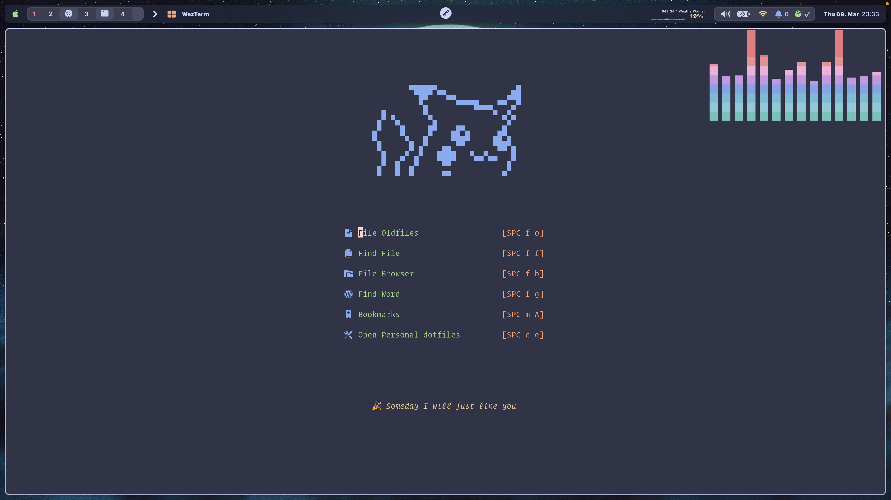

<h1 align="center">
  
  Eugene Neovim Config
  
</h1>

<p align="center">
  <a href="https://github.com/command-z-z/EugeneVim/stargazers">
    
  </a>
  <a href="https://github.com/command-z-z/EugeneVim/issues">
    
  </a>
  <a href="https://github.com/command-z-z/EugeneVim/contributors">
    
  </a>
  <a href="https://github.com/command-z-z/EugeneVim/blob/master/LICENSE"
    ></a>
</p>

> 👀 I encourage you to fork this repo and create your own experience. Learn how to tweak and change Neovim to the way YOU like it. This is my cultivation of years of tweaking, use it as a git remote and stay in-touch with upstream for reference or cherry-picking.

## 🌊 Screenshot

<p align="center">
  
</p>

## 🎁 Features

- Fastest startup time in 80-100ms.

- Modern structure

- 50 plus plugin
  
- Lightweight

## 🔌 Main Plugin

1.LSP

2.DAP

3.UI

4.CODE

5.TOOL

## 🍭 Usage

```
git clone https://github.com/command-z-z/EugeneVim.git ~/.config/nvim
```

>NOTE:back up your nvim config first.

## 🔑 Keymap

## 💭 About

Hi there is my personal neovim config with neovim nightly.

<p align="center">
  Copyright &copy; 2023-present
  <a href="https://github.com/command-z-z" target="_blank">Eugene</a>
</p>
