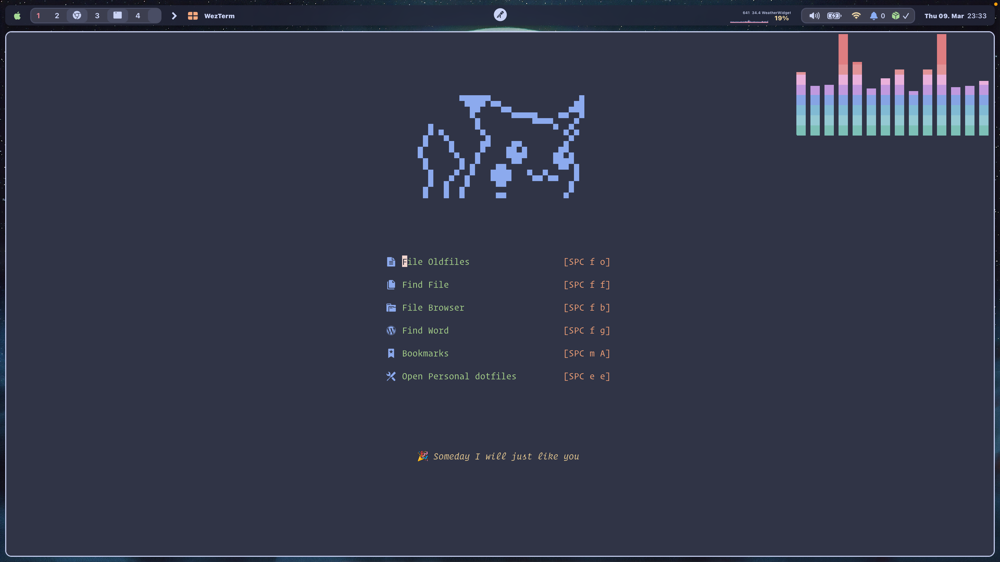

# 🧭 Eugene Neovim 配置

<p align="center">
  <a href="https://github.com/command-z-z/EugeneVim/stargazers">
    
  </a>
  <a href="https://github.com/command-z-z/EugeneVim/issues">
    
  </a>
  <a href="https://github.com/command-z-z/EugeneVim/blob/master/LICENSE">
    
  </a>
</p>

> 🇺🇸 English documentation: [README.md](./README.md)

这是一个个人 Neovim 配置，基于 `lazy.nvim`、现代 LSP API、Telescope、blink.cmp、Catppuccin 和一组实用编辑工具构建。

## 📸 截图

<p align="center">
  
</p>

## ✨ 特性

- 模块化 `lazy.nvim` 插件配置
- 以 Telescope 为核心的搜索工作流
- 内置 LSP、补全、格式化和 lint
- Gitsigns + Diffview Git 工作流
- 浮动终端和可选 Lazygit 集成
- 支持 session 恢复、代码折叠、snippets 和启动页

## 🧰 环境要求

- Neovim 0.12 或更新版本
- `git`
- `ripgrep`，用于 Telescope 搜索和 TODO 搜索
- `make` 和 C 编译器，用于编译 `telescope-fzf-native.nvim`
- Node.js 和 npm，部分 Mason 工具需要
- Python 3，用于 Python 工具链
- 可选：`lazygit`，用于 `<leader>gg`

## 🚀 安装

先备份现有 Neovim 配置：

```sh
mv ~/.config/nvim ~/.config/nvim.bak
```

克隆本仓库：

```sh
git clone https://github.com/command-z-z/EugeneVim.git ~/.config/nvim
```

启动 Neovim，让 `lazy.nvim` 自动安装插件：

```sh
nvim
```

如需检查或手动安装工具，打开 Mason：

```vim
:Mason
```

## 🗂️ 目录结构

```text
init.lua
lua/
  options.lua
  mappings.lua
  plugins/
    init.lua
    ui.lua
    editor.lua
    search.lua
    lsp.lua
    git.lua
snippets/
```

`lua/plugins/init.lua` 负责启动 `lazy.nvim` 并导入插件分组。每个插件分组都维护自己的懒加载规则、配置和快捷键。

## 🔌 插件栈

- 界面：Catppuccin、lualine、bufferline、dashboard-nvim、noice.nvim、indent-blankline、which-key
- 搜索：Telescope、telescope-fzf-native、telescope-file-browser、todo-comments
- 编辑：nvim-treesitter、nvim-ufo、nvim-autopairs、flash.nvim、persistence.nvim
- 补全：blink.cmp、friendly-snippets、本地 snippets
- LSP 和工具链：nvim-lspconfig、Mason、mason-lspconfig、mason-tool-installer、conform.nvim、nvim-lint、Trouble
- Git 和终端：gitsigns.nvim、diffview.nvim、toggleterm.nvim

## 🧠 语言支持

已配置的 LSP：

- Python：`pyright`
- Lua：`lua_ls`
- C/C++：`clangd`
- Rust：`rust_analyzer`
- Go：`gopls`

已配置的格式化和检查工具：

- Lua：`stylua`
- Python：`ruff`
- C/C++：`clang-format`
- Shell：`shfmt`
- Markdown：`markdownlint`

Mason 会在启动时尽可能自动安装这些工具。

## ⌨️ 快捷键

Leader 键是 `<Space>`。

### 💾 文件和配置

| 快捷键 | 功能 |
| --- | --- |
| `<C-s>` | 保存文件 |
| `<leader>ee` | 编辑 Neovim 配置 |
| `Q` | 退出当前窗口 |

### 🪟 窗口

| 快捷键 | 功能 |
| --- | --- |
| `<leader>ws` | 水平分屏 |
| `<leader>wv` | 垂直分屏 |
| `<leader>wh` | 移动到左侧窗口 |
| `<leader>wj` | 移动到下方窗口 |
| `<leader>wk` | 移动到上方窗口 |
| `<leader>wl` | 移动到右侧窗口 |
| `<M-left>` | 减小窗口宽度 |
| `<M-right>` | 增加窗口宽度 |
| `<M-up>` | 增加窗口高度 |
| `<M-down>` | 减小窗口高度 |

### 📚 Buffer

| 快捷键 | 功能 |
| --- | --- |
| `<Tab>` | 下一个 buffer |
| `<S-Tab>` | 上一个 buffer |
| `<leader>bb` | 使用 Telescope 查找 buffer |
| `<leader>bd` | 删除 buffer |
| `<leader>1` 到 `<leader>9` | 跳转到指定编号 buffer |

### 🔎 搜索

| 快捷键 | 功能 |
| --- | --- |
| `<leader>ff` | 查找文件 |
| `<leader>fg` | 全局文本搜索 |
| `<leader>fh` | 查找帮助标签 |
| `<leader>fo` | 最近打开文件 |
| `<leader>fb` | 文件浏览器 |
| `<leader>fB` | 从当前 buffer 目录打开文件浏览器 |
| `<leader>fF` | 从当前 buffer 目录查找文件 |
| `<leader>fG` | 从当前 buffer 目录搜索文本 |
| `<leader>ft` | 查找 TODO 注释 |
| `<leader>s` | Flash 跳转 |
| `<leader><leader>s` | Flash Treesitter 跳转 |

### ✍️ 编辑

| 快捷键 | 模式 | 功能 |
| --- | --- | --- |
| `jk` | Insert | 退出插入模式 |
| `<C-h>` | Insert | 光标左移 |
| `<C-j>` | Insert | 光标下移 |
| `<C-k>` | Insert | 光标上移 |
| `<C-l>` | Insert | 光标右移 |
| `<C-d>` | Insert | 删除下一个字符 |
| `H` | Normal / Visual | 跳到行首非空字符 |
| `L` | Normal / Visual | 跳到行尾 |
| `<C-h>` | Normal / Visual / Operator | 向左移动 5 个字符 |
| `<C-j>` | Normal / Visual / Operator | 向下移动 5 行 |
| `<C-k>` | Normal / Visual / Operator | 向上移动 5 行 |
| `<C-l>` | Normal / Visual / Operator | 向右移动 5 个字符 |
| `<C-a>` | Normal | 全选 |
| `<leader>y` | Normal | 复制到系统剪贴板 |
| `<leader>p` | Normal | 从系统剪贴板粘贴 |

### 🧩 补全

| 快捷键 | 功能 |
| --- | --- |
| `<C-n>` | 选择下一个补全项 |
| `<C-p>` | 选择上一个补全项 |
| `<C-space>` | 显示补全或文档 |
| `<C-e>` | 隐藏补全菜单 |
| `<CR>` | 接受补全项 |
| `<Tab>` | 选择下一项或跳到 snippet 下一个位置 |
| `<S-Tab>` | 选择上一项或跳到 snippet 上一个位置 |

### 🧪 代码和 LSP

| 快捷键 | 功能 |
| --- | --- |
| `gd` | 跳转到定义 |
| `gr` | 重命名符号 |
| `K` | 查看悬浮文档 |
| `<leader>ca` | Code action |
| `<leader>cf` | 格式化当前 buffer |
| `<leader>cl` | 检查当前 buffer |
| `<leader>cx` | 工作区诊断 |
| `<leader>cX` | 当前 buffer 诊断 |
| `<leader>o` | 文档符号列表 |

### 🌿 Git

| 快捷键 | 功能 |
| --- | --- |
| `<leader>gd` | 打开 Diffview |
| `<leader>gh` | 当前文件 Git 历史 |
| `<leader>gH` | 仓库 Git 历史 |
| `<leader>gq` | 关闭 Diffview |
| `<leader>gp` | 预览 hunk |
| `<leader>gr` | 回退当前 hunk |
| `<leader>gb` | 查看当前行 blame |
| `<leader>gf` | 对比当前文件 |
| `<leader>gB` | 切换当前行 blame |
| `<leader>gL` | 切换删除行显示 |

### 🖥️ 终端

| 快捷键 | 模式 | 功能 |
| --- | --- | --- |
| `<leader>tt` | Normal | 切换浮动终端 |
| `<leader>gg` | Normal | 切换 Lazygit |
| `<C-\>` | Normal / Terminal | 切换终端 |
| `<Esc>` | Terminal | 退出终端模式 |

### 🧷 Session 和折叠

| 快捷键 | 功能 |
| --- | --- |
| `<leader>qs` | 恢复 session |
| `<leader>ql` | 恢复上一次 session |
| `<leader>qd` | 停止 session 保存 |
| `zR` | 打开所有折叠 |
| `zM` | 关闭所有折叠 |
| `zp` | 预览折叠内容 |

## 🩺 健康检查

排查问题时常用命令：

```vim
:Lazy
:Lazy profile
:checkhealth lazy
:checkhealth vim.lsp
:checkhealth nvim-treesitter
:Mason
:ConformInfo
```

快速 headless 启动检查：

```sh
nvim --headless '+lua print("config loaded")' '+qa'
```

## 🛠️ 自定义

- 在 `lua/plugins/` 下对应模块中添加插件。
- 在 `lua/plugins/lsp.lua` 中添加语言服务器和工具链。
- 在 `lua/options.lua` 中添加编辑器选项。
- 在 `lua/mappings.lua` 中添加全局快捷键。
- 在 `snippets/` 中添加本地 snippets。

尽量把插件配置放在 lazy spec 中，这样加载时机、快捷键和配置会集中在同一个地方。

## 📝 说明

这套配置跟随当前 Neovim API，目标版本是 Neovim 0.12+。如果需要兼容旧版本 Neovim，需要调整 LSP 配置。

## 📄 许可证

MIT
